# BPMN-Extension for Franka Emika Desk

## About
The BPMN-Desk extension enables the web-based creation and execution of collaborative human-robot processes using the cobot Panda by Franka Emika.  

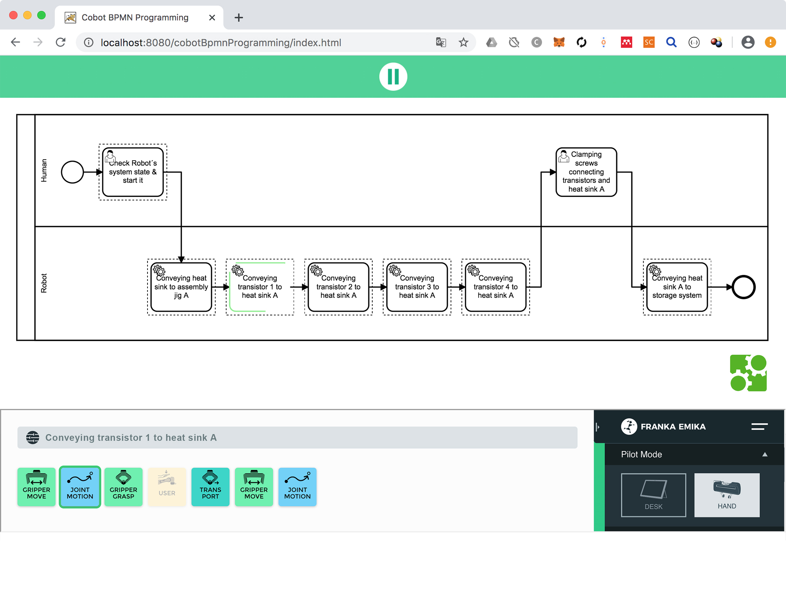  

[Business Process Model and Notation](https://www.bpmn.org) (short BPMN) is a visual modeling language for business processes. By using a so-called BPMN-engine since version 1.2 also the execution of the processes is possible. For the execution of the created human-robot processes Camunda BPM was used. [Camunda BPM](https://camunda.com/) is a widespread open source project, which provides various tools for modelling as well as for executing BPMN 2.0 models.
For the user interface of the BPMN extension the open source project [BPMN.iO](https://bpmn.io/) was used as a basis. BPMN.iO provides tools that enable the creation of BPMN 2.0 models in the browser.

## How it works

The extension allows a web-based creation and execution of workflows between human and robot using BPMN. For this purpose, so-called Service Tasks and User Tasks are used.

###### Service Tasks

Service Tasks are all those tasks which are executed by the cobot Panda. For this it is necessary to create tasks in the Desk UI (e.g. in the following example the task "Conveying transistor 1 to heat sink A" was created in Desk.

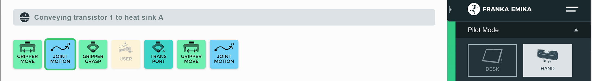
  

To use this task in the BPMN extension we first create a service task. The name of the task can be chosen freely.

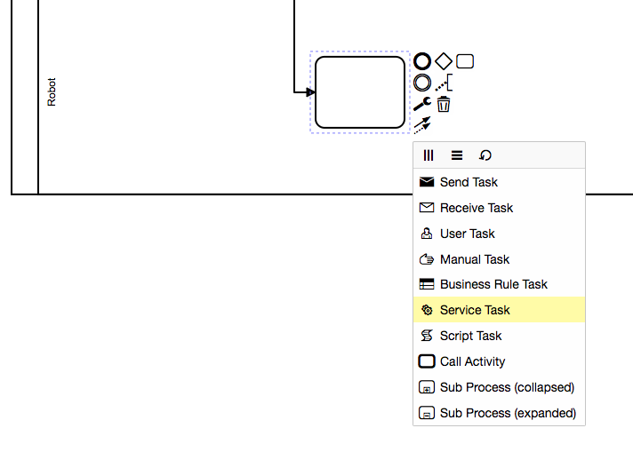
  
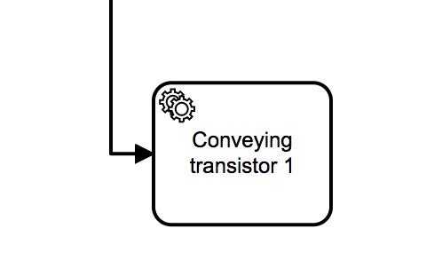
  
In the next step we have to create a parameter "name" for the Service Task, which contains the name of the task to be executed in Desk. Click on the Input/Output tab. Create a new parameter with Name "name" and Value "Conveying transistor 1 to heat sink A".   

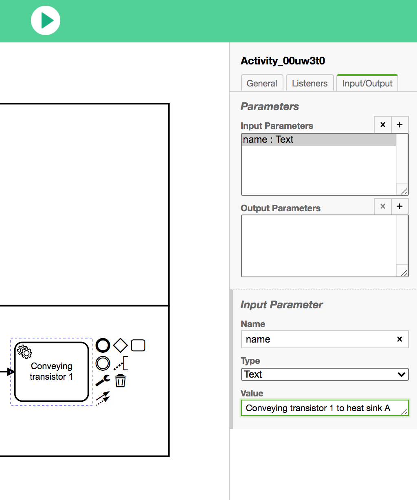

###### User Tasks

User tasks are all those tasks which are executed by humans. To complete a User Task while the process is running, simply click on the respective task.

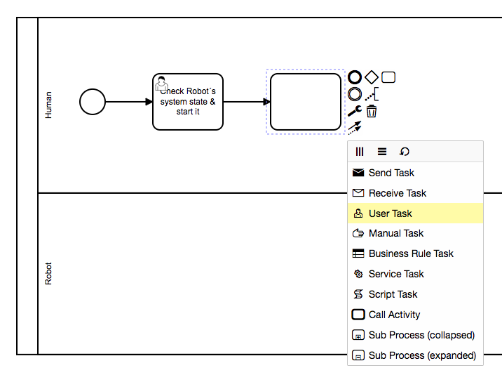
  

##### Software Architecture

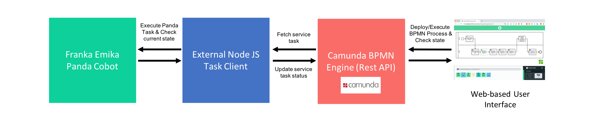 

As shown in the figure above the architecture consists of the following four main components:

###### Web-based User Interface:
The UI is based on the open source project BPMN.iO and was extended by the possibility to start the process in the BPMN engine via the play button on top. If the button is clicked, the process is deployed in the BPMN engine and then executed. Furthermore, the status of the BPMN process is continuously queried via the Camunda Rest API and displayed in the diagram using Javascript.

When executing the BPMN process, the UI consists of the following two areas. The upper area shows the current status of the BPMN process. In the lower area (when executing service tasks) the Desk UI is displayed, which shows the activities of the robot in detail.  

  

###### Camunda BPMN Engine (Rest API):
The Camunda BPM Engine is used to execute the BPMN process.

###### External Node JS Task Client:
For the execution of the external tasks (service tasks) of the BPMN engine a so-called Task Client is used. This is a NodeJS application that fetches open service tasks. The task client starts the corresponding task of the cobot via REST API.

###### Franka Emika Panda Cobot (Rest API):
The Rest api call to start a task looks like this:

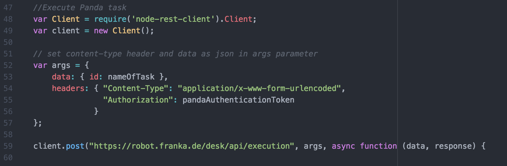  

## Installation

#### Install Camunda
To get the project running you first have to install the [Camunda Open Source Community Platform](https://camunda.com/de/download/).
Start up Camunda. You can check if it is running by opening the following link. [http://localhost:8080/camunda-welcome/index.html](http://localhost:8080/camunda-welcome/index.html).

#### Download Project
Download and unzip Prototype.zip. Copy the folder into the "webapps" directory of your Camunda BPMN installation.

#### Update Panda Authentication Token
Update the Panda authentication token in Task-Client/app.js.

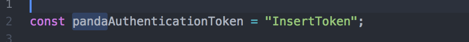

#### Start NodeJS Task Client
Prerequisite: NodeJS must be installed.
Start the Task Client via Terminal or Command-Line: node task-client.js

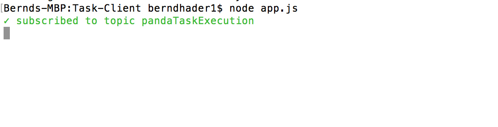

#### Open UI
Open the UI in your browser and create a new process or use an existing one:
[http://localhost:8080/PandaBPMN/Prototype/Panda-BPMN-Extension/index.html](http://localhost:8080/PandaBPMN/Prototype/Panda-BPMN-Extension/index.html).

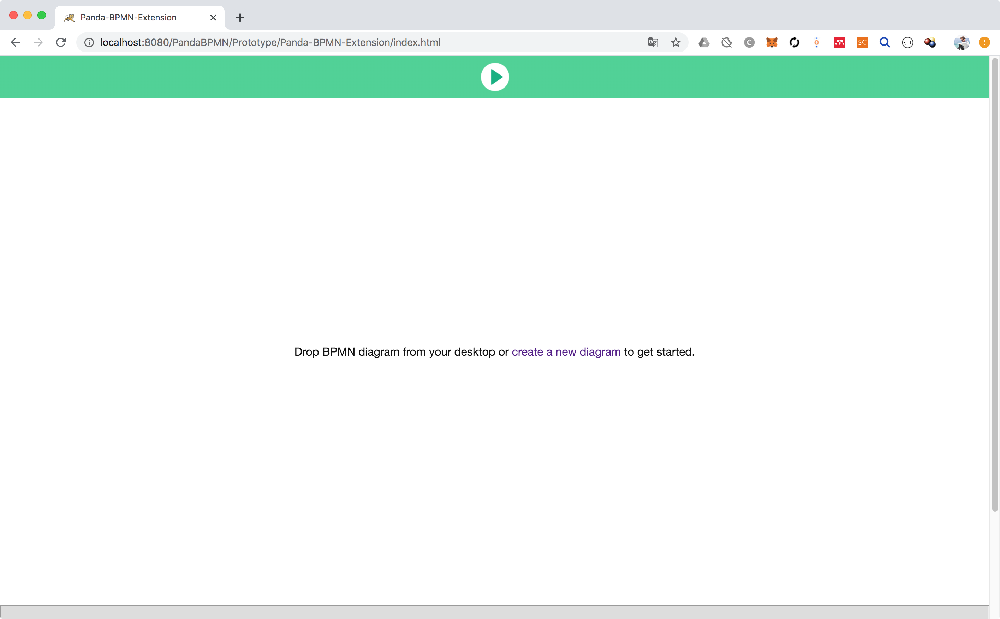
  
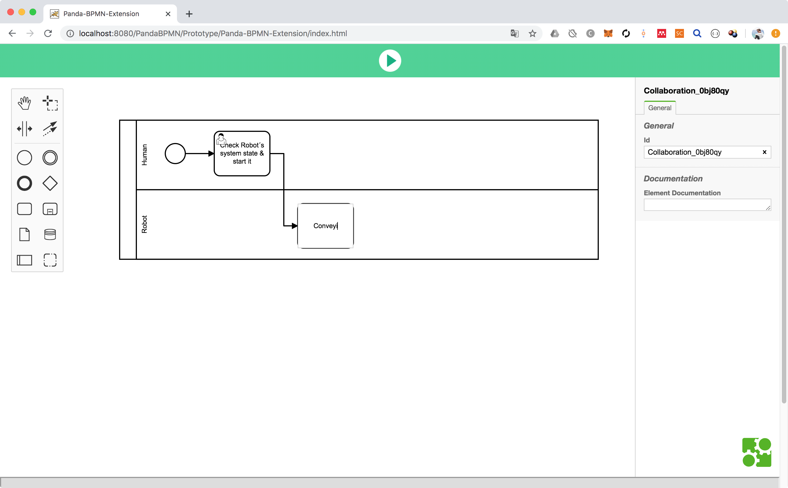
 

## Demo video
Here's a demo video where you can see the prototype in action. In the video this prototype is used to assemble a heat sink.

[https://drive.google.com/file/d/1dxnogMM3uGuruhbgZRNAQOgPjw_f3b7I/view?usp=sharing](https://drive.google.com/file/d/1dxnogMM3uGuruhbgZRNAQOgPjw_f3b7I/view?usp=sharing)
